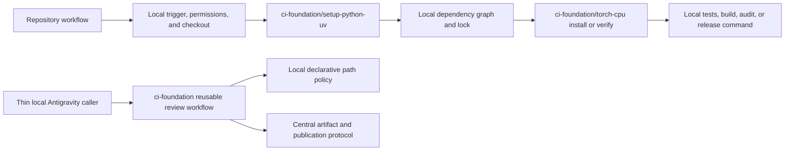

# Greenfield shared CI foundation for the Albumentations ecosystem

**Status:** Proposed

**Scope:** Shared GitHub Actions infrastructure for AlbumentationsX, Albucore, and albumentations.ai. Repository-specific tests, dependency declarations, release policy, legal policy, and deployment remain owned by each repository.

## Decision

Create a public repository named `albumentations-team/ci-foundation` and move three proven cross-repository capabilities into it:

1. a composite action that installs Python and `uv` with consistent caching;
2. a composite action that installs or verifies the CPU-only Torch runtime used by automation; and
3. a reusable Antigravity review workflow with one security model and one publication path.

Every consuming workflow references the foundation by a full commit SHA. Local workflows keep their trigger, permissions, checkout policy, dependency selection, test command, artifacts, and required-check names visible.

The first release does not contain a universal CI workflow. A universal workflow would need caller-provided shell commands and many repository-specific switches. That interface would hide policy, weaken validation, and make routine changes depend on a large conditional abstraction.

## Why a separate repository is required

AlbumentationsX and Albucore are public repositories. GitHub allows a public repository to call reusable workflows only from the same repository or another public repository. `albumentations.ai` is private and can also consume a public action. The shared foundation therefore has to be public if all three repositories use it.

A dedicated repository also gives the shared code its own tests, release history, CODEOWNERS, security review, and immutable consumer pins. Copying an action between application repositories preserves the current drift because each copy can evolve independently.

## Current duplication and drift

The three repositories repeat the same mechanisms with different levels of maturity:

| Area | AlbumentationsX | Albucore | albumentations.ai | Consequence |
| --- | --- | --- | --- | --- |
| Python and `uv` setup | Local composite action | Repeated workflow steps | Nine setup blocks in `ci.yaml` | Cache and version policy drift |
| CPU Torch source | Explicit `pytorch-cpu` uv source | Explicit `pytorch-cpu` uv source plus inline installs | CPU index repeated in requirements inputs, generated locks, and lock verification | The same invariant has several encodings |
| CPU Torch verification | `tools/torch_runtime.py` | CI matrix checks installation syntax | No shared post-install runtime verifier | CUDA dependency regressions are detected unevenly |
| Antigravity | Trusted-base workflow, 215 lines | Closely related trusted-base workflow, 237 lines | Different 121-line workflow | Security and failure-handling behavior diverges |
| Action pinning | Full commit SHAs in critical workflows | Mix of SHAs and major tags | Mostly version tags | Updates and hardening are inconsistent |
| Python dependency model | `pyproject.toml` plus a real `uv.lock` | `pyproject.toml` plus a real `uv.lock` | `requirements*.in` compiled to committed `requirements*.txt`; placeholder eight-line uv locks | AI appears to have two lock systems although only one carries dependencies |

The repeated lines are a symptom. The maintenance problem is that the same invariant can be fixed in one repository and remain stale in another.

## Ownership boundary

The foundation owns mechanisms whose behavior should be identical everywhere. Each repository owns decisions that describe its product or package.



### Foundation-owned contracts

The new repository owns:

- pinned versions of third-party actions used inside foundation code;
- Python and `uv` bootstrap behavior;
- cache-input normalization for the bootstrap action;
- the canonical PyTorch CPU index URL;
- CPU Torch installation and runtime verification logic;
- rejection of CUDA and NVIDIA distributions in CPU-only automation;
- Antigravity trusted-base checkout, untrusted-diff handling, diagnostics, review artifact transport, and publication separation;
- tests for its actions and reusable workflows; and
- release tags, changelog, compatibility policy, and consumer upgrade notes.

### Repository-owned contracts

Each consumer retains:

- workflow triggers and branch filters;
- `GITHUB_TOKEN`, OIDC, environment, and deployment permissions;
- checkout ref, history depth, and credential persistence;
- supported Python and Torch versions;
- package metadata and dependency groups;
- lockfiles and Docker dependency exports;
- the decision that a job needs Torch;
- test selection, sharding, coverage, benchmarks, and artifacts;
- release, publishing, license, CLA, SBOM, and deployment policy; and
- required-check names consumed by branch protection.

These fields remain local because a change to them changes repository behavior. Reviewers should see that change in the repository where it takes effect.

## Target repository

The initial `ci-foundation` tree should stay small:

```text
ci-foundation/
├── .github/
│   ├── workflows/
│   │   ├── ci.yml
│   │   ├── release.yml
│   │   └── antigravity-review.yml
│   └── dependabot.yml
├── actions/
│   ├── setup-python-uv/
│   │   └── action.yml
│   └── torch-cpu/
│       ├── action.yml
│       └── verify_torch_cpu.py
├── tests/
│   ├── test_action_contracts.py
│   ├── test_antigravity_contract.py
│   └── test_torch_cpu.py
├── CHANGELOG.md
├── CODEOWNERS
├── LICENSE
└── README.md
```

Do not add Node, Yarn, Docker, release publishing, or legal verification actions in the first release. They either have one consumer or encode materially different repository contracts.

### Document ownership after repository creation

This file is the canonical plan until `ci-foundation` exists. Phase 1 moves the maintained architecture and contribution guidance into that repository. The AlbumentationsX copy is then deleted and its design index keeps one external link. Albucore and AI link to the same document instead of copying it.

## Shared Python and uv bootstrap

`actions/setup-python-uv` wraps `astral-sh/setup-uv` and exposes only stable setup inputs:

```yaml
- uses: albumentations-team/ci-foundation/actions/setup-python-uv@<full-commit-sha>
  with:
    python-version: "3.13"
    cache-dependency-glob: |
      pyproject.toml
      uv.lock
    cache-suffix: ci-test-torch-cpu
    activate-environment: "true"
```

The action installs no project dependency. The caller runs an explicit `uv sync`, `uv pip install`, or lock verification step immediately afterward.

Checkout remains a local workflow step. Checkout refs and credentials are security decisions, especially for `pull_request_target`, release, and deployment workflows. Hiding them inside a general setup action would make those decisions harder to review.

The action must preserve these performance properties:

- one Python/uv setup operation per job;
- no additional resolver invocation;
- cache keys include every lock or requirements input that can change the environment; and
- the median setup duration does not regress by more than 10% or 15 seconds, whichever is larger, across representative cache-hit and cache-miss runs.

## Shared CPU Torch contract

CPU Torch is one automation policy with three local dependency formats. The shared action owns installation mechanics and runtime verification. The repository still declares why and which Torch version it needs.

### Action interface

The first version supports two explicit modes:

```yaml
- uses: albumentations-team/ci-foundation/actions/torch-cpu@<full-commit-sha>
  with:
    mode: verify
    python: python
```

```yaml
- uses: albumentations-team/ci-foundation/actions/torch-cpu@<full-commit-sha>
  with:
    mode: install
    python: python
    requirement: "torch>=2.13.0"
```

`verify` performs no installation. It proves that:

- top-level `torch` imports successfully;
- the installed build reports no CUDA runtime;
- installed distribution metadata contains no `cuda*` or `nvidia-*` packages; and
- the result can be written as JSON evidence when the caller requests an output path.

`install` requires an explicit Torch requirement, installs it from the canonical CPU backend, and runs the same verifier. The action has no accelerator mode and no automatic fallback to PyPI.

The action must not call `torch.cuda`, `torch.mps`, device discovery, stream, autograd, or allocator APIs. Verification inspects version and distribution metadata only, so it does not initialize an accelerator.

### Local declarations after standardization

| Repository | Local source of truth | Shared action use |
| --- | --- | --- |
| AlbumentationsX | `ci-torch-cpu` group and explicit `pytorch-cpu` uv source | `verify` after the locked sync; `install` only in clean-wheel or exact lower-bound environments |
| Albucore | `torch` extra and explicit `pytorch-cpu` uv source | `verify` after installing the extra; `install` in clean artifact smoke tests |
| albumentations.ai | `requirements-transform.in`, compiled into root and API production locks | `verify` after installing each production lock |

This preserves self-contained locks. A user or Docker build can install a repository's dependencies without fetching CI configuration from another repository.

### What disappears from consumer workflows

Consumer workflows should contain no CPU index URL, no `--torch-backend cpu`, and no inline scan for CUDA/NVIDIA distributions. Those details live in the shared action. Local manifests retain the dependency declaration required to build their own locks.

## Put albumentations.ai on one Python dependency model

AI should continue compiling pip-compatible production locks because both Dockerfiles install `requirements.txt` with standard `pip`. A full migration to project-based `uv sync` would still require exported requirements for the images and would add another conversion boundary.

The cleanup uses the existing requirements model consistently:

1. Make `requirements-transform.in` the shared runtime input for generated documentation and the FastAPI service.
2. Declare the CPU index and `torch>=2.13.0` there alongside the pinned AlbumentationsX and `albu-spec` pair.
3. Keep root-only documentation dependencies in root `requirements.in`.
4. Keep API-only service dependencies in `apps/api/requirements.in`.
5. Remove repeated CPU-index lines and the direct Torch declaration from the root and API inputs.
6. Compile root, API production, and API development locks from those inputs.
7. Remove the CI `sed` steps that inject the CPU index into generated files.
8. Delete the root and API eight-line `uv.lock` placeholders because they contain no dependency graph.
9. Keep committed `requirements*.txt` files as Docker and CI installation artifacts.
10. Run the shared `torch-cpu` verifier after installing root and API production locks.

The resulting graph is explicit:

```text
requirements-transform.in
├── albumentationsx==<validated-version>
├── albu-spec==<validated-version>
├── torch>=2.13.0
└── PyTorch CPU index

requirements.in
├── -r requirements-transform.in
└── docs-only dependencies

apps/api/requirements.in
├── -r ../../requirements-transform.in
└── API-only dependencies
```

Torch can no longer appear in the API lock only because an upstream package happened to declare it. The AI runtime owns the declaration because it imports AlbumentationsX.

## Reusable Antigravity workflow

The first reusable workflow should implement the trusted-base model already used by AlbumentationsX and Albucore:

1. The thin caller listens to `pull_request_target` and checks that the PR is eligible.
2. The reusable workflow checks out the exact base SHA with persisted credentials disabled.
3. GitHub API responses provide the PR metadata, changed paths, and diff as untrusted data.
4. A declarative repository file decides whether the review should run and which paths the model may inspect.
5. The model receives the trusted instructions and the untrusted review material through separate files.
6. The analysis job has read-only repository access plus OIDC. It cannot publish a PR review.
7. A successful sanitized Markdown artifact crosses into a separate publication job.
8. The publication job has `pull-requests: write` and no OIDC permission.
9. Failure diagnostics are uploaded before the workflow fails.

Each repository keeps a small configuration file such as `.github/ci-foundation/antigravity.toml`:

```toml
[paths]
include = ["**"]
exclude = ["docs/generated/**", "benchmark/results/**"]

[review]
instructions = ".github/antigravity-review.md"
```

Path matching, review extraction, empty-response handling, artifact names, and publication behavior live in `ci-foundation`. The local configuration contains data only; it cannot inject a shell command.

The local caller should be small enough to review in one screen:

```yaml
name: Antigravity PR Checks

on: # zizmor: ignore[dangerous-triggers]
  pull_request_target:
    branches: [main]
    types: [opened, reopened, synchronize, ready_for_review]

permissions: {}

jobs:
  review:
    if: >-
      ${{
        github.event.pull_request.draft == false &&
        github.event.pull_request.head.repo.full_name == github.repository
      }}
    permissions:
      contents: read
      id-token: write
      pull-requests: write
    uses: albumentations-team/ci-foundation/.github/workflows/antigravity-review.yml@<full-commit-sha>
    with:
      policy-path: .github/ci-foundation/antigravity.toml
```

The called workflow reduces permissions for its analysis and publication jobs. Nested workflows cannot elevate permissions, so the caller must authorize the union and the called workflow must narrow each job.

## Versioning and supply-chain policy

Every foundation release receives a semantic tag and a changelog entry. Consumers reference the exact commit behind that release:

```yaml
uses: albumentations-team/ci-foundation/actions/torch-cpu@0123456789abcdef0123456789abcdef01234567 # v1.1.0
```

Branches and tags are convenient for humans and remain mutable references. Full SHAs are the execution contract. Automated dependency updates may open a PR that moves the SHA and comment together; the consumer's own CI validates the new foundation revision before merge.

The repository requires:

- CODEOWNERS approval for `actions/**` and `.github/workflows/**`;
- full-SHA pins for every third-party action;
- minimal top-level permissions and job-specific grants;
- `actionlint`, Zizmor, Python tests, and fixture workflows on every PR;
- protected release tags; and
- release notes that identify breaking input, output, permission, and runtime changes.

## Tests in ci-foundation

The foundation is complete only when it can test itself independently of all three consumers.

### Static contracts

- Validate every `action.yml` and reusable workflow as YAML.
- Run `actionlint` and Zizmor.
- Reject branch and tag references for third-party actions.
- Assert explicit `permissions` blocks.
- Assert that the Torch action contains one canonical CPU index.
- Assert that the Antigravity analysis job cannot write pull requests and its publication job cannot request OIDC.

### Torch behavior

- `verify` passes in a CPU-only environment.
- `verify` fails when Torch is absent.
- Unit fixtures reject CUDA version metadata and CUDA/NVIDIA distribution names without loading accelerator APIs.
- `install` creates a CPU-only environment from scratch on Linux, macOS, and Windows.
- Evidence JSON records the Torch version, CUDA metadata, and matching accelerator distributions.

### Consumer fixtures

Small fixture projects exercise:

- a `pyproject.toml` plus `uv.lock` installation;
- a compiled `requirements.txt` installation;
- cache keys with different dependency globs and runtime suffixes; and
- the Antigravity selected, skipped, empty-response, analysis-failure, sanitization-failure, and publication paths.

Fixtures contain no copy of a real consumer's full workflow.

## Rollout

Each phase ends with deletion of the superseded local implementation. No phase keeps a silent fallback or runs old and new implementations in parallel after validation.

### Phase 1: Create and harden ci-foundation

1. Create the public repository.
2. Add the two composite actions and their tests.
3. Add the reusable Antigravity workflow and declarative policy parser.
4. Move the maintained architecture from this file into the foundation repository and leave one external link in each consumer.
5. Add CI, CODEOWNERS, changelog, and release process.
6. Publish `v1.0.0` and record its full SHA.

Completion condition: fixture workflows pass on Linux, macOS, and Windows; actionlint and Zizmor pass; third-party actions are SHA-pinned.

### Phase 2: Canary in AlbumentationsX

1. Make the local `setup-ci` action call the shared bootstrap action while retaining AX tool-group and runtime-profile policy.
2. Replace duplicated CPU runtime verification with the shared `torch-cpu` verifier.
3. Keep `tools/torch_runtime.py` only for AX-specific clean-wheel state transitions that the shared action cannot express.
4. Move generic CPU inspection code into `ci-foundation` and delete its AX copy.
5. Replace the Antigravity body with the thin caller and local declarative policy.
6. Remove Antigravity-only parsing from `tools/ci_plan.py` and delete `tools/antigravity_review.py` once the shared workflow owns those behaviors.

Completion condition: the full AX PR matrix is green at one head SHA; static jobs remain Torch-free; package-importing jobs report CPU-only Torch; current required-check names remain stable.

### Phase 3: Migrate Albucore

1. Replace repeated Python/uv setup steps with the shared bootstrap action.
2. Install Albucore's local `torch` extra, then use shared verification.
3. Use shared `install` for clean artifact smoke tests that have no project dependency sync.
4. Replace the Antigravity body with the thin caller.
5. Delete `tools/antigravity_plan.py`, `tools/antigravity_review.py`, and tests whose behavior moved to foundation fixtures.
6. Remove inline CPU index and `--torch-backend cpu` strings from workflows.

Completion condition: supported Python tests, macOS arm64 regression tests, declared dependency ranges, package smoke, security audits, and release-candidate verification pass with the expected CPU runtime.

### Phase 4: Clean and migrate albumentations.ai

1. Normalize the requirements graph described above.
2. Regenerate and review all committed requirements locks.
3. Delete placeholder uv locks and CI index-injection code.
4. Replace repeated Python/uv setup blocks with the shared bootstrap action.
5. Verify both docs and API environments with the shared Torch action.
6. Build both Docker images from the committed locks and run their smoke checks.
7. Replace the Antigravity body with the same trusted-base caller and an AI path policy.

Completion condition: lock verification has no file rewriting, both Docker images build from committed locks, docs generation and API import succeed with CPU Torch, and frontend-only jobs install no Python/Torch environment.

### Phase 5: Remove ecosystem-wide residue

Run repository-wide searches in all three consumers and delete remaining shared-mechanism copies:

```bash
rg -n "download\.pytorch\.org|--torch-backend cpu|nvidia-|torch\.version\.cuda" .github
rg -n "run-gemini-cli|Prepare review artifact|Publish Antigravity" .github/workflows
rg -n "astral-sh/setup-uv" .github/workflows
```

Allowed results after cutover:

- consumer dependency manifests may name the CPU source required to build their own lock;
- thin callers may reference `ci-foundation` by full SHA; and
- repository-specific clean-wheel tools may invoke the shared action or verifier through their documented boundary.

Completion condition: workflows contain no copied CPU-Torch mechanics, no copied Antigravity orchestration, and no direct Python/uv bootstrap outside an explicitly justified exception.

## Consumer validation

Every migration PR must show these checks at the same head SHA:

| Contract | AlbumentationsX | Albucore | albumentations.ai |
| --- | --- | --- | --- |
| Static job installs no Torch | Required | Required where applicable | Required for frontend-only jobs |
| Import-capable job has CPU Torch | Required | Required | Required for docs and API |
| CUDA/NVIDIA distributions absent | Required | Required | Required |
| Locked dependency install | `uv sync --locked` | locked/exact local command | committed compiled requirements |
| Clean artifact smoke | wheel without and with externally installed Torch | wheel/runtime smoke | both Docker images |
| Workflow hardening | Zizmor and repository contracts | Zizmor and CI matrix | Zizmor and build-contract tests |
| Full repository CI | Required | Required | Required |

A local unit test cannot prove the integration alone. The final evidence is a fresh CI run in each consumer against the exact foundation SHA it pins.

## Deletion checklist

The migration is unfinished while any of these remain:

- copied Antigravity workflow bodies;
- repository-local copies of generic review sanitization or artifact transport;
- inline CPU-index or CPU-Torch installation commands in workflows;
- duplicate CUDA/NVIDIA runtime scanners;
- AI's placeholder `uv.lock` files;
- AI's `sed`-based mutation of compiled lock output;
- direct `setup-uv` blocks covered by the shared action;
- copied versions of this architecture document after `ci-foundation` becomes its owner;
- compatibility aliases for old action input names; or
- dual execution of old and shared CI paths.

Rollback uses a normal Git revert to the previous consumer SHA. The production configuration contains one active path at a time.

## Explicit non-goals

This plan does not centralize:

- test commands, test matrices, sharding, coverage thresholds, or benchmark budgets;
- package dependency groups or supported-version policy;
- Docker builds, GCP deployment, PyPI publication, or release promotion;
- license, CLA, notice, or SBOM verification;
- Node/Yarn setup while AI is its only consumer;
- repository-specific change classification and required-check aggregation;
- CUDA, MPS, ROCm, accelerator discovery, or GPU CI; or
- a generic action that executes caller-supplied shell commands.

New shared components require evidence from at least two repositories and one stable invariant. Similar-looking YAML in one repository is not sufficient justification.

## Completion conditions

The Greenfield architecture is complete when:

- `albumentations-team/ci-foundation` is public, protected, tested, and versioned;
- every consumer pins foundation actions and workflows by full commit SHA;
- Python/uv bootstrap, CPU Torch mechanics, and Antigravity orchestration each have one implementation;
- repositories retain their own dependency graphs and visible job policy;
- AI has one real Python dependency model and no placeholder uv locks;
- static jobs do not acquire Torch through shared setup;
- every automated Torch environment is verified as CPU-only without accelerator initialization;
- all superseded local code, tests, docs, aliases, and fallback paths are deleted; and
- all three repositories pass fresh CI against the same reviewed foundation release.

## References

- [GitHub: Reuse workflows](https://docs.github.com/en/actions/how-tos/reuse-automations/reuse-workflows)
- [GitHub: Reusing workflow configurations](https://docs.github.com/en/actions/reference/workflows-and-actions/reusing-workflow-configurations)
- [GitHub: Sharing actions and workflows with an organization](https://docs.github.com/en/actions/how-tos/reuse-automations/share-with-your-organization)
- [Greenfield Torch dependency and CI architecture](torch-dependency-and-ci-greenfield.md)
- [AlbumentationsX CI policy](../maintaining/ci-policy.md)
