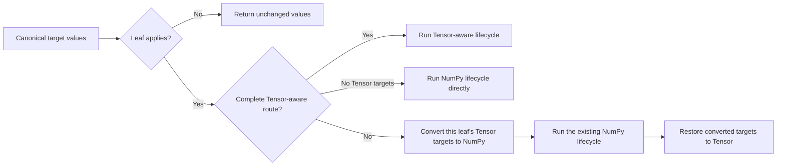

# NumPy and CPU Tensor Transform Routing

**Status:** Implemented

## Public behavior

`Compose` accepts NumPy arrays and plain CPU `torch.Tensor` values. Each target keeps the container supplied by the
caller: NumPy targets return as NumPy arrays, and Tensor targets return as Tensors. One call may mix containers across
targets.

`Compose` normalizes optional channel axes before transform dispatch. NumPy targets are channel-last; Tensor targets
are channel-first.

### Images and volumes

| Target | Container | Accepted by `Compose` | Inside `Compose` | Returned container |
| --- | --- | --- | --- | --- |
| `image` | NumPy | `H,W` or `H,W,C` | `H,W,C` | NumPy |
| `image` | Tensor | `H,W` or `C,H,W` | `C,H,W` | Tensor |
| `images` | NumPy | `N,H,W` or `N,H,W,C` | `N,H,W,C` | NumPy |
| `images` | Tensor | `N,C,H,W` | `N,C,H,W` | Tensor |
| `volume` | NumPy | `D,H,W` or `D,H,W,C` | `D,H,W,C` | NumPy |
| `volume` | Tensor | `C,D,H,W` | `C,D,H,W` | Tensor |

For video passed as `images`, `N=T`; the Tensor layout is `T,C,H,W`. Normal `DataLoader` collation produces
`B,T,C,H,W`. A model that consumes `B,C,T,H,W` performs that model-specific permutation after augmentation.

### Masks

| Target | Container | Accepted by `Compose` | Inside `Compose` |
| --- | --- | --- | --- |
| `mask` | NumPy | `H,W` or `H,W,C` | `H,W,C` |
| `mask` | Tensor | `H,W` or `C,H,W` | `C,H,W` |
| `masks` | NumPy | `N,H,W` or `N,H,W,C` | `N,H,W,C` |
| `masks` | Tensor | `N,H,W` or `N,C,H,W` | `N,C,H,W` |
| `mask3d` | NumPy | `D,H,W` or `D,H,W,C` | `D,H,W,C` |
| `mask3d` | Tensor | `D,H,W` or `C,D,H,W` | `C,D,H,W` |

Mask channels may hold categorical labels, independent binary planes, depth values, or another target-specific value.
Transforms apply masks only through their declared target methods.

### Optional-channel restoration

When a public input omits its channel axis, `Compose` adds a singleton axis before the first transform. It removes that
axis at the public boundary only when the result still has one channel.

```text
NumPy H,W  -> internal H,W,1 -> public H,W
Tensor H,W -> internal 1,H,W -> public H,W
```

A channel-changing transform keeps the resulting channel axis. For example, a NumPy `H,W` image transformed to RGB
returns as `H,W,3`.

Empty `Compose`, root `p=0`, skipped transforms, and `NoOp` return the original target object when no transform changes
it. Applied transforms do not guarantee storage identity, contiguity, strides, or aliasing.

### Independent target containers

Container choice is per target:

```python
transform(image=numpy_image, mask=tensor_mask)
transform(image=tensor_image, mask=numpy_mask, bboxes=tensor_boxes)
```

Each returned target uses its own input container. `additional_targets` inherit the layout and container behavior of
their canonical target type.

### Bounding boxes and keypoints

Tensor `bboxes` and `keypoints` use two-dimensional `float32` matrices shaped as `N,K`. Their processors temporarily
use NumPy for preprocessing, filtering, and postprocessing, then restore Tensor output with the resulting row count.
NumPy annotations return as NumPy arrays. Python sequence annotations remain Python sequences.

Annotation containers do not need to match image or mask containers.

## Tensor input boundary

AlbumentationsX accepts exact `torch.Tensor` instances with these properties:

- CPU device;
- `torch.strided` layout;
- `requires_grad=False`;
- a rank listed in the target tables;
- a dtype listed below.

Tensor subclasses and accelerator Tensors are rejected. Non-contiguous positive-stride Tensors are accepted; a helper
may materialize contiguous or writable storage when its kernel requires it.

| Target family | Accepted Tensor dtypes |
| --- | --- |
| `image`, `images`, `volume` | `torch.uint8`, `torch.float32` |
| `mask`, `masks`, `mask3d` | `torch.uint8`, `torch.int16`, `torch.float32` |
| `bboxes`, `keypoints` | `torch.float32` |

This table describes validation at the `Compose` boundary. An applied fallback uses the transform's existing NumPy
implementation and preserves the accepted dtype unless that transform's public contract intentionally changes it.

Complex, quantized, and floating Tensor dtypes other than `float32` are rejected during root validation.

## Execution model

### Ownership

| Layer | Responsibility |
| --- | --- |
| Root `Compose` | Validate Tensor inputs before sampling, add optional channels, and restore public rank |
| Annotation processors | Adapt Tensor bbox and keypoint matrices around the existing NumPy processor lifecycle |
| `BasicTransform` | Select the route for one applied leaf and own fallback conversion |
| Functional helpers and Albucore | Execute the selected NumPy or Tensor-aware operation |
| Concrete transform | Declare targets and implement transform semantics |

Nested `Compose`, `OneOf`, `SomeOf`, `Sequential`, and `ReplayCompose` nodes do not create representation boundaries.
Each applied leaf selects its own route.



### Root normalization

The root validates recognized Tensor targets and declared target-bearing metadata before it samples Compose
probability or transform parameters. It then adds optional channel axes and stores call-local restoration state.

Shape checks use logical spatial axes. A Tensor image and a NumPy image therefore report the same height and width even
though their channel axes differ.

Direct calls to a leaf transform bypass root normalization. Tensor targets passed directly to a leaf must already use
their canonical inside-`Compose` layout.

### Leaf-local fallback

For a call that contains no Tensor targets, `BasicTransform` enters the existing NumPy lifecycle directly.

For a Tensor call, the leaf collects only recognized Tensor targets that it dispatches or reads through
`targets_as_params`. A complete Tensor-aware route may handle the call directly. Otherwise, the leaf converts those
targets to canonical channel-last NumPy views, runs parameter extraction, sampling, target dispatch, and output
construction through the existing lifecycle, then restores the converted outputs to Tensor.

A skipped leaf performs no conversion. Two consecutive fallback leaves may each perform their own conversion pair.

### Tensor-aware routes

A Tensor-aware route covers the complete leaf invocation for the supplied targets and supported channel counts. Calls
outside that capability use the leaf-local fallback.

The selected implementation may still use a local NumPy bridge when that complete route is faster. Tensor-aware
describes the accepted input and output container contract, not an exclusive use of Torch kernels.

### Declared metadata

`targets_as_params` is the only transform-level declaration for auxiliary data. A transform does not define a separate
Tensor schema or Tensor adapter.

The base adapter handles Tensor values under those keys as follows:

- a direct Tensor parameter becomes a NumPy view with the same rank and dtype;
- a sequence of Tensor reference images uses the `image` layout conversion;
- standard target fields in donor records use their public target conversion, with `semantic_mask` treated as `mask`;
- direct Tensor fields with other names become NumPy views without layout changes; and
- nested containers below an unrecognized field remain unchanged.

This keeps crop coordinates, callback inputs, and custom auxiliary arrays under the transform's existing NumPy
contract. Standard spatial donor fields accept the same optional-channel forms as their public target family.

The fallback restores the original metadata container after the leaf invocation.

### `ToTensorV2` and `ToTensor3D`

`ToTensorV2` and `ToTensor3D` are NumPy-to-Tensor terminal transforms. They accept NumPy inputs only.

When a Compose call contains any Tensor target, the presence of either terminal transform anywhere in the selectable
graph raises an error before probability or parameter sampling. Mixed-container calls follow the same rule.

### Conversion and storage

Fallback uses `Tensor.numpy()` and `torch.from_numpy()` views when the dtype and strides permit them. Axis changes such
as `C,H,W` to `H,W,C` are views when possible. A helper materializes data when the selected kernel requires contiguous
or writable input, or when a NumPy result has negative strides that Torch cannot represent.

Transforms must not modify caller input values in place. Applied outputs carry no public storage-sharing guarantee.

### Sampling, replay, and concurrency

Route state belongs to one invocation. It is not stored on the configured transform or Compose graph.

- Root validation happens before RNG consumption.
- Skipped transforms do not bridge data.
- Route selection happens before target-dependent sampling.
- Replay applies recorded parameters through the route selected for the replay input container.
- Tracing, applied-configuration capture, and overlapping calls use the same invocation-local state model.

## References

- [Generated Transform Target Contracts](transform-target-contracts.md)
- [Compose Serialization and Execution Tracing](compose-serialization-and-tracing.md)
- [Instance Binding](instance_binding.md)
- [PyTorch `Tensor.numpy`](https://docs.pytorch.org/docs/stable/generated/torch.Tensor.numpy.html)
- [PyTorch `torch.from_numpy`](https://docs.pytorch.org/docs/stable/generated/torch.from_numpy.html)
