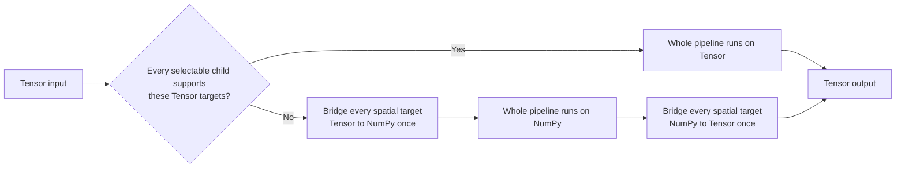

# Torch CPU Backend and Tensor-Native Compose Plan

**Status:** In progress

**Decision:** `torch` becomes a required dependency. The existing `Compose` accepts both NumPy arrays and CPU
`torch.Tensor` values. Every valid Tensor pipeline returns Tensor output. Before transform parameters are sampled,
`Compose` chooses one representation for the entire pipeline: direct Tensor execution when every selectable child
supports the supplied Tensor targets, otherwise one Tensor-to-NumPy bridge before the pipeline and one NumPy-to-Tensor
bridge after it. New direct Tensor routes require full-path benchmark evidence. NumPy input retains its existing NumPy
flow unless an explicit terminal `ToTensorV2` or `ToTensor3D` transform requests Tensor output.

**Primary workload:** a PyTorch training process in which Torch is already imported. Steady-state `DataLoader`
throughput is a milestone integration gate. Individual transform pull requests use direct and `Compose` benchmarks
without rebuilding and timing a complete loader for every matrix cell.

## Current implementation status

The repository is in the foundation stage. `torch` is now a required dependency. `Compose` accepts every validated CPU
Tensor pipeline and returns Tensor output. If every selectable transform supports the supplied Tensor targets, the
pipeline runs directly on Tensor values. If any transform lacks that direct route, `Compose` converts every spatial
target to its established channel-last NumPy layout once before the pipeline and restores Tensor layouts once after
postprocessing. This keeps arbitrary transform combinations usable without letting individual helpers call `.numpy()`
or `torch.from_numpy()` themselves.

The boundary continues to reject accelerators, autograd inputs, mixed spatial representations, and terminal
Tensor transforms. Bbox and keypoint processors use the same central bridge and return `float32` Tensor matrices at the
public boundary. Tensor capabilities now choose the direct fast path; they no longer decide whether a valid `Compose`
pipeline can accept Tensor input. `NoOp` accepts every supported Tensor target. `Flip3D` accepts Tensor `volume` and
`mask3d` through the central NumPy bridge while retaining semantic label mappings.

The repository also contains `python -m tools.tensor_compose_benchmark`. It records raw model-ready `Compose` and
optional steady-state `DataLoader` measurements as JSON. Run it after a change to Compose, a bridge, batching, or
collation. Do not run it for every individual transform capability.

The first pilot, `HorizontalFlip`, was rejected on the current macOS ARM development host. A contiguous `C,H,W` RGB
Tensor must become a strided `H,W,C` view before it reaches the existing OpenCV helper. Across the 256, 512, and 1024
matrix, that route was much slower than the NumPy baseline. `torch.flip` also lost on the required 1- and 3-channel
cells. Torch won on some contiguous 5-channel cells, but a partial win cannot accept a route that regresses common
RGB inputs. No PyTorch primitive is missing, so this is a retained-backend decision rather than an upstream request.

`VerticalFlip` was also rejected: `torch.flip` loses on the required 256-pixel C=1 and C=3 cells, even though it wins
selected larger cells. The route therefore remains NumPy/Albucore rather than creating a partial Tensor capability.

The first 3D investigation rejected `CenterCrop3D`, `RandomCrop3D`, and `CubicSymmetry` as native CPU Tensor routes.
For no-padding crops, direct `Compose(volume=Tensor)` was 1.40x to 1.67x the NumPy route over the small and medium
volume matrix (C=1, C=3, C=5; `uint8` and `float32`). Reusing the NumPy crop helper through the shared bridge was
slower still. A correctness-equivalent `CubicSymmetry` prototype reduced all 48 symmetries to one Tensor permutation
and at most one flip or clone, but it still lost on required common cells; only the medium C=5 `float32` subset won.
`Pad3D` with `torch.nn.functional.pad` likewise lost by 1.10x to 3.43x outside the one medium C=5 `float32` win. The
needed Torch operations exist, so no upstream feature request is open. These transforms use Compose's NumPy bridge
until a future CPU release or a different full-path implementation passes every required cell.

The initial integration run measured workers 0 and 2 successfully. The 8-worker run did not finish on this macOS ARM
host and produced no artifact. Repeat the 0, 2, and 8 worker suite on the stable Linux x86-64 benchmark host before
marking Phase 1 complete. The route result must include the generated JSON, not only a summary.

## Problem and goal

Today, a caller that trains a PyTorch model normally augments a NumPy array and converts it to Tensor at the end. This
adds representation boundaries and may copy data. Some Torch CPU kernels can replace NumPy, OpenCV, or NumKong work.
Others cannot match their speed or semantics. A global replacement would regress part of the matrix.

The goal is to remove only the boundaries and helpers that full measurements prove safe. The result preserves the
current NumPy contracts and adds a direct Tensor input form for training pipelines. It does not require all work to use
one backend.

## Decisions

### One Compose and two representations

There is one public `Compose`, one transform hierarchy, and one parameter-sampling and replay flow. `apply`,
`apply_to_images`, and `apply_to_volume` decide target policy and dispatch. Reusable pixel arithmetic remains in the
functional layer or Albucore.

For Tensor input, `Compose` makes one route decision for the complete transform chain:



This route prevents representation changes between individual transforms. A pipeline with several NumPy-backed
transforms pays one pair of bridges, not one pair per transform. An empty pipeline and a pipeline skipped by `p=0`
return the original Tensor objects without a bridge.

`Compose` owns every spatial conversion, layout adapter, and output repair. Transform helpers receive either their
established NumPy layout or their declared Tensor layout. They must not add an ad hoc `.numpy()`, `torch.from_numpy()`,
or layout conversion.

### Compose route-selection invariant

For every valid CPU Tensor call, `Compose` evaluates all selectable descendants before parameter sampling. `OneOf`,
`SomeOf`, `Sequential`, and other nested compositions qualify for direct Tensor execution only when every branch that
may run supports every supplied Tensor target. A wrapper that creates its own representation boundary also selects the
NumPy route.

The direct route is an optimization. A missing direct capability never rejects a valid Tensor input; it selects the
whole-pipeline NumPy route. Tensor input still rejects accelerator tensors, autograd tensors, mixed spatial
representations, and redundant `ToTensorV2` or `ToTensor3D` terminal transforms.

### Tensor boundary contract

The public CPU Tensor contract is channel first:

| Compose target | Tensor shape | Meaning |
|---|---|---|
| `image` | `C, H, W` | One 2D image |
| `images` | `C, L, H, W` | Sequence of images; `L=N` for an image sequence and `L=T` for video frames |
| `volume` | `C, D, H, W` | One medical or scientific volume |

`images` and `volume` deliberately share the four-axis pattern `C, L, H, W`. The target key gives the second axis its
meaning. `images` selects framewise image semantics; `volume` selects volume and 3D-transform semantics. No `video`
or `videos` target is introduced by this work.

Normal `DataLoader` collation adds the outer batch axis. A 3D video model receives `B, C, T, H, W`; a volume model
receives `B, C, D, H, W`. This matches the input convention of `torch.nn.Conv3d` and common PyTorch video models.

The logical axes are fixed. There is no public `data_format`, `channel_first`, or `channel_last` parameter.
`torch.channels_last` and `torch.channels_last_3d` are physical-memory-format candidates only at valid batched model
boundaries. They do not alter the public Tensor axis contract.

NumPy callers retain the current explicit-channel, channel-last contracts: `H,W,C`, `N,H,W,C`, and `D,H,W,C`.

### Annotation Tensor boundary

When the caller supplies an image Tensor, every supplied spatial target also uses Tensor form. This removes the
last public representation boundary before `DataLoader` collation. Annotation axes follow PyTorch training
conventions rather than the image channel convention:

| Compose target | Tensor shape | Dtype | Meaning |
|---|---|---|---|
| `mask` | `H,W` | `uint8`, `int64`, `float32`, or `bool` | One semantic, regression, or binary mask |
| `masks` | `N,H,W` | `uint8`, `int64`, `float32`, or `bool` | `N` instance masks |
| `mask3d` | `D,H,W` | `uint8`, `int64`, `float32`, or `bool` | One volumetric mask |
| `bboxes` | `N,K` | `float32` | `N` boxes in the configured current coordinate format; the existing processor defines columns after coordinates |
| `keypoints` | `N,K` | `float32` | `N` keypoints in the configured current coordinate format; the existing processor defines extra columns |

`mask` has no channel axis because a training mask usually stores one label or value per pixel. `masks` adds an
instance axis, not an image-channel axis. If a model needs a channel-first target, the dataset or collate function
creates that model-specific form after `Compose`.

The implementation keeps one transform hierarchy. The central bridge converts Tensor annotations for NumPy processors
and restores Tensor output. The bridge owns conversion, layout, and ownership checks. No transform-specific helper may
convert an annotation silently.

### Invocation concurrency

One configured `Compose` object supports overlapping `__call__()` and `run_with_trace()` invocations. Tensor route
selection, bridge planning, preprocessing, parameter sampling, transform execution, applied-configuration capture,
postprocessing, restoration, and cleanup belong to that call's `InvocationContext`.

A short seed-reservation lock protects only the configured worker-stream counter. Each caller receives private Python
and NumPy streams, so work after reservation can run concurrently. Default seeded results follow reservation order;
`invocation_seed` makes a result independent of worker scheduling. Separate `DataLoader` worker processes still own
separate Python pipeline objects.

### CPU-only boundary

The first stage accepts CPU tensors with `requires_grad=False`.

- `Compose` exposes no `device` parameter and never calls `.to(device)`.
- CUDA, MPS, XPU, and other accelerator tensors are rejected during capability validation.
- The pipeline does not construct an autograd graph, manage streams, set global Torch thread settings, or change the
  caller's grad mode, RNG state, deterministic-algorithm setting, or default dtype.
- `DataLoader(pin_memory=True)` and host-to-device transfer remain training-code responsibilities after `Compose`.

`ToTensorV2` and `ToTensor3D` remain explicit NumPy-to-Tensor terminal transforms. The CPU routing work does
not change their NumPy behavior. A Tensor-native pipeline does not contain either transform because its input is
already Tensor. Tensor capability validation reports a clear error when a Tensor-input pipeline still contains one and
asks the caller to remove it.

Accelerator support is a later project phase. It reuses the Tensor and capability contracts only after the CPU routes
have passed their performance gate.

## Compose route selection

### Capability declaration

Each transform family and reusable functional helper receives a private capability record. It declares:

- supported targets, dtypes, ranks, channel counts, layouts, strides, and parameter modes;
- exact output shape, dtype, range, mutation, aliasing, RNG, replay, and annotation behavior;
- available implementations: current backend, Torch, or both;
- valid entry and exit bridges, including all required layout views and copies;
- benchmark cells and status: `accepted`, `partial_route`, `existing_backend`, `rejected`, or `blocked_upstream`.

`Compose` uses the capability records only to select the whole-pipeline Tensor or NumPy route. It does not stitch
Tensor and NumPy subsegments. Route selection must not change probabilities, parameter sampling, replay, or transform
order.

### Bridges are operations, not bookkeeping

On a supported CPU array/Tensor, `torch.from_numpy(array)` and `tensor.numpy()` can share storage. That does not make a
route free. Torch dispatch, reference lifetime, unsupported strides, read-only storage, layout views, and a required
contiguous copy all affect wall time and ownership.

A Tensor pipeline using the NumPy route commonly needs these steps:

```text
C,L,H,W Tensor → layout view for the NumPy helper → NumPy helper → output layout view → Tensor
```

Any `.contiguous()`, `np.ascontiguousarray()`, dtype cast, or allocation is O(n). The benchmark includes it. The
compatibility bridge is chosen when a pipeline needs a NumPy-only transform, so it may cost more than a direct Tensor
route. It still preserves the input representation and gives every valid pipeline one `Compose` API.

NumPy-to-Tensor routing is outside this CPU stage. A future route must include its bridge, layout conversion, and return
conversion in the complete-path benchmark.

### Backend decision rule

For every matrix cell:

1. Keep the direct Tensor route when every selectable transform supports every supplied Tensor target and the complete
   path meets the performance gate.
2. If any selectable transform lacks that direct route, bridge all spatial targets once to NumPy, execute the full
   pipeline there, and restore Tensor output once.
3. Add a new direct Tensor route only when it is faster or tied within calibrated noise and every other contract is
   equal.
4. At a measured tie, prefer the direct route because it removes the whole-pipeline representation boundary.

The input representation does not force the backend. It determines only the input and output representation seen by
the caller.

## Performance invariant and evidence

### Acceptance condition

> No direct Tensor route may show a repeatable CPU slowdown in any required benchmark cell.

The one-time NumPy bridge is a compatibility route, not evidence that a transform has a fast Tensor implementation. It
must preserve values, target alignment, layouts, dtypes, replay, and output representation. Its measured cost is
reported when shared Compose or bridge code changes.

Torch is imported before both baseline and candidate timing. Cold import time, wheel size, and install time are tracked
as dependency diagnostics; they do not decide a hot training-path route.

For NumPy input, the baseline is the current public NumPy `Compose` or functional call. Each transform capability has
two blocking comparisons that do not construct a `DataLoader`:

1. **Direct Compose gate:** run the same transform chain and sampled parameters with pre-created, logically identical
   NumPy and CPU Tensor inputs. Input construction and output normalization for value comparison stay outside the timed
   block. `Compose(image=tensor)` must be no slower than `Compose(image=array)` in every accepted cell. Measure both a
   shared-storage channel-first Tensor view and a native contiguous channel-first Tensor where either is supported.
2. **Model-ready output gate:** compare NumPy `Compose` plus the existing explicit terminal `ToTensorV2` or
   `ToTensor3D` conversion with direct Tensor `Compose`. This is a controlled `Compose` benchmark with pre-created
   inputs; it does not include collation or `DataLoader` workers.

The direct gate detects Tensor-dispatch and route-selection overhead. The model-ready output gate measures the cost to
produce the Tensor that the model consumes. A candidate includes every bridge and layout operation that occurs inside
its timed path.

A transform PR reports every direct helper, ordered-chain, direct-Compose, and model-ready-output cell. The output report
records raw before/after measurements rather than aggregates alone.

### Benchmark cadence

`DataLoader` and collation measure shared integration behavior. Repeating them for every transform would multiply the
runtime without isolating that transform's kernel or dispatch cost. Use this cadence:

| Change | Required benchmark |
|---|---|
| `Compose`, preprocessing, postprocessing, shape handling, or common bridge | Direct microbenchmarks, `Compose`, and representative `DataLoader`/collation cases |
| One transform or functional family gains Tensor capability | Direct functional, ordered chain, direct `Compose`, and model-ready output; no `DataLoader` |
| Capability coverage changes a pipeline from NumPy to direct Tensor execution | Ordered chain and `Compose`; add one representative `DataLoader` case only when a shared boundary or batch behavior changed |
| Milestone, release candidate, or scheduled performance run | Full representative `DataLoader` suite for NumPy, direct Tensor, and bridged Tensor routes |

This keeps per-transform feedback short while preserving an integration gate for changes that can affect the whole
training input pipeline.

### Required matrix

Every affected 2D route covers the repository matrix where supported:

| Resolution | Channels | Typical workload |
|---|---:|---|
| 256 × 256 | 1, 3, 5 | Classification and RGBD/multispectral training |
| 512 × 512 | 1, 3, 5 | Detection and segmentation |
| 1024 × 1024 | 1, 3, 5 | High-resolution, medical, and satellite workloads |

Run `uint8` and `float32` whenever the public function supports them. Also cover positive and negative strides,
read-only storage, non-contiguous Tensor inputs, image sequences, video-through-`images`, masks and target
annotations where applicable, and the selected parameter axes.

When the integration suite runs, it holds batch size, workers, persistent workers, prefetching, pinning, collation, and
output consumption constant. It compares decoded NumPy samples, direct Tensor samples, bridged Tensor samples, and 0,
2, and 8 workers where the workload is relevant.

### Correctness and ownership gates

An accepted route preserves:

- target alignment for image, mask, bbox, OBB, keypoint, volume, and metadata;
- shape, axis meaning, dtype, value range, exact integer behavior, and documented floating tolerance;
- seeded RNG behavior, replay records, transform probability, and constructor serialization;
- caller-visible mutation and aliasing behavior; and
- output representation: backend routing returns the input representation. Existing explicit terminal `ToTensorV2`
  and `ToTensor3D` transforms retain their documented NumPy-to-Tensor behavior.

A Tensor call may use the whole-pipeline NumPy route internally. `Compose` controls and reports that boundary. It is
not an implicit fallback hidden inside a helper.

## Implementation phases

### Phase 0 — dependency and baselines

1. Add the validated Torch floor to runtime dependencies. Keep TorchVision optional.
2. Update lockfile, CI, platform/Python support checks, SBOM/security inputs, and environment reporting.
3. Measure baseline variance on a stable Linux x86-64 machine. Calibrate a repeatability threshold no larger than 1%.
4. Add the route-result JSON schema: environment, input representation, transform IDs, selected route, every bridge,
   raw samples, correctness result, memory result, and decision.

Exit: a default install includes Torch, and the benchmark runner can distinguish a real regression from noise.

### Phase 1 — prove the complete Compose Tensor lifecycle once

The first runtime pull request changes the framework plumbing. It does not add Tensor implementations to every public
transform.

1. Define Array-or-Tensor internal types and the fixed Tensor target contracts.
2. Extend `Compose` input checks, shape extraction, preprocessing, target routing, postprocessing, and output repair for
   CPU Tensor input.
3. Pass Tensor values through `BasicTransform.__call__`, `apply_with_params`, and the existing `apply_*` dispatch.
4. Use a minimal private probe transform to prove that the Tensor arriving at `apply` or `apply_to_images` also leaves
   `Compose` as Tensor. Test empty pipelines, `p=0`, nested compositions, additional targets, masks, annotations,
   replay, and boundary failures.
5. Reject accelerator tensors, `requires_grad=True`, and Tensor-input pipelines containing `ToTensorV2` or
   `ToTensor3D` with actionable errors.
6. Preserve every NumPy test and benchmark result.
7. Run the representative `DataLoader` and collation suite once for this shared lifecycle change.

Exit: the full `Compose` wrapper accepts every valid CPU Tensor pipeline and returns Tensor output. Direct Tensor
capabilities remain opt-in performance routes and land with their own evidence.

### Phase 2 — add the central bridge and the first two capabilities

1. Build one bridge API for Tensor/NumPy conversion, axis adapters, ownership checks, and route diagnostics.
2. Add the capability record and whole-pipeline route selection needed by the first pilots. Do not build a
   segment-level optimizer before real capabilities exist.
3. Prove one Tensor input that uses a faster NumPy/OpenCV helper and returns Tensor.
4. Preserve the current NumPy input flow and its output representation.
5. Run direct, `Compose`, model-ready-output, and one representative `DataLoader` benchmark for each bridge direction.

Exit: the compatibility bridge preserves correctness for every valid Tensor pipeline. Direct Tensor capabilities pass
their full-path performance gates before they are enabled.

### Phase 3 — add Tensor support one transform family at a time

Each transform-family pull request follows the same bounded workflow:

1. Freeze the current NumPy contract and save reference outputs for every target, dtype, channel count, and parameter
   mode in scope.
2. Identify the best direct Tensor route. It may call a Torch helper or an existing backend that accepts the declared
   Tensor layout. A transform that still needs NumPy remains on the Compose NumPy route.
3. Add the Tensor implementation to the existing functional and `apply_*` flow. Keep reusable arithmetic in the
   functional layer or Albucore; do not add a parallel transform class.
4. Add correctness tests for Tensor input and confirm that NumPy input remains unchanged.
5. Run direct functional, ordered-chain, direct `Compose`, and model-ready-output benchmarks for NumPy and Tensor.
   Do not run `DataLoader` for this transform PR unless it changes shared bridge, route selection, batching, or
   collation code.
6. Accept, narrow, reject, or mark the capability `blocked_upstream`.
7. Preserve the existing NumPy route. A NumPy-to-Tensor proposal is separate work with its own full-path benchmark.

Land one operation family, capability record, tests, benchmark artifact, and routing change per pull request.

### Phase 4 — broaden capability coverage and run milestones

As accepted capabilities accumulate, more pipelines qualify for direct Tensor execution. A capability change runs its
ordered-chain and `Compose` benchmarks. Add a representative `DataLoader` case only when it changes a shared bridge,
route selection, or batch behavior.

Run the complete `DataLoader` suite on scheduled milestones and before release. It covers NumPy input, direct Tensor
input, bridged Tensor input, video-through-`images`, volume, and the supported worker matrix.

### Phase 5 — audit retained backends and prepare accelerators

After the CPU registry is complete, publish the retained NumPy, OpenCV, NumKong, Albucore, and Torch routes with their
evidence. Removing a dependency requires a separate audit showing no remaining required or faster route.

Accelerator work later adds device and stream capability, transfer planning, synchronization-aware benchmarks, and
RNG/autograd policy. It does not change the public Tensor axis contract or create another composition API.

## Missing Torch operations

An unavailable primitive, missing dtype/stride support, incorrect semantics, or unavoidable losing copy blocks only its
candidate. Open the request where the missing capability belongs:

- PyTorch for a general Tensor operator, CPU dispatch, dtype, stride, correctness, or performance gap;
- Albucore for a reusable image-processing helper or shared bridge contract;
- TorchVision for a vision-specific operator that does not belong in core Torch; or
- AlbumentationsX for transform semantics and local routing.

The issue or pull request includes:

- a minimal input and expected result;
- dtype, shape, stride, layout, and device;
- a correctness reproducer;
- a self-contained benchmark; and
- the affected capability IDs and fallback decision.

The registry marks that candidate `blocked_upstream` and the next candidate proceeds. A missing operation never blocks
unrelated migration work.

## Completion criteria

The CPU program is complete when:

- Torch is a required dependency on supported platforms;
- `Compose` accepts every valid declared CPU Tensor pipeline and returns Tensor output for Tensor input;
- `Compose` selects either direct Tensor execution or the whole-pipeline NumPy route before parameter sampling;
- every accepted route has permanent correctness tests and full per-cell performance evidence;
- every direct Tensor route passes both the direct Tensor-Compose and model-ready-output performance gates;
- Compose route-selection milestones and release candidates pass the representative `DataLoader` suite;
- no direct Tensor route has a repeatable CPU regression;
- all missing primitives have an upstream artifact or explicit retained-backend decision; and
- the audit explains every retained backend and leaves a reusable capability contract for future accelerator work.

## References

- [PyTorch `Conv2d`](https://docs.pytorch.org/docs/2.13/generated/torch.nn.Conv2d.html)
- [PyTorch `Conv3d`](https://docs.pytorch.org/docs/2.13/generated/torch.nn.Conv3d.html)
- [PyTorch tensor memory formats](https://docs.pytorch.org/docs/2.13/tensor_attributes.html)
- [TorchVision Tensor conventions](https://docs.pytorch.org/vision/stable/transforms.html)
- [PyTorchVideo data convention](https://pytorchvideo.readthedocs.io/en/latest/data.html)
- [Kornia `VideoSequential`](https://kornia.readthedocs.io/en/v0.6.3/_modules/kornia/augmentation/container/video.html)
- [MONAI transform conventions](https://docs.monai.io/en/0.9.1/transforms.html)
- [TorchIO transform input](https://docs.torchio.org/latest/transforms/)
