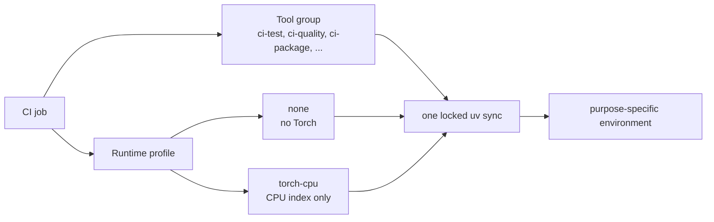

# Greenfield Torch dependency and CI architecture

**Status:** Implemented

**Scope:** Packaging, development environments, documentation builds, CI
dependency profiles, install smoke tests, and release verification. Tensor
execution and backend routing are outside this dependency architecture.

## Decision

Torch is an externally managed, soft-required runtime:

- `pip install albumentationsx` installs neither Torch, TorchVision, CUDA
  libraries, nor an accelerator runtime;
- the user installs the CPU, CUDA, or MPS Torch build needed by the
  application before importing AlbumentationsX;
- importing `albumentations` requires Torch and gives an installation error
  only when the top-level `torch` module is absent;
- importing AlbumentationsX does not lazily load Torch and does not call CUDA,
  MPS, device, stream, or autograd APIs; and
- every CI job that imports AlbumentationsX explicitly selects CPU-only Torch.

The CPU build is a CI runtime choice. It is not package metadata and cannot
replace a Torch build selected by an application.

## Why CI has separate tool and runtime axes

Package metadata cannot choose the right Torch distribution for every user. A
generic requirement can pull a large runtime into a documentation build or
audit that never imports the library, and may select CUDA packages on Linux.

Removing Torch from package metadata creates a complementary rule: a process
that imports `albumentations` must already have Torch. Pytest imports
`tests/conftest.py` before applying markers, so `pytest -m "not pytorch"` still
needs Torch. Markers select tests; they do not change package import behavior.

Every CI job therefore declares two independent inputs:



The shared setup action accepts this contract:

```yaml
with:
  python-version: "3.12"
  dependency-group: ci-test
  runtime-profile: torch-cpu
```

`runtime-profile` defaults to `none`. `torch-cpu` adds `ci-torch-cpu` to the
same locked `uv sync`, uses the explicit PyTorch CPU index, checks that
`torch.version.cuda is None`, rejects installed `cuda*` and `nvidia-*`
distributions, and records the selected profile in the job environment.
Cache keys include both axes.

## Package and contributor contracts

`project.dependencies`, optional extras, Conda `run` dependencies, and
`requirements-dev.txt` do not select Torch or TorchVision. The project does
not provide an `albumentationsx[torch]` extra: that extra could not know whether
the user needs CPU, CUDA, or MPS.

The supported installation order is:

1. Install the required Torch build using the platform-specific PyTorch
   command.
2. Install AlbumentationsX and the desired OpenCV extra.
3. Import AlbumentationsX.

The Linux CPU-only command may use the PyTorch CPU index. CUDA and MPS
instructions point users to the PyTorch selector. AlbumentationsX never chooses
an accelerator build for them.

`dev` contains contributor tools but no Torch runtime. `uv sync --inexact`
preserves a developer's existing CPU, CUDA, or MPS installation. A developer
who wants the CI runtime adds `--group ci-torch-cpu` explicitly.

## CI profiles

| Tool group | Purpose | Torch selected by the group |
| --- | --- | --- |
| `ci-test` | pytest, xdist, coverage, Hypothesis, test libraries, headless OpenCV | No |
| `ci-quality` | Ruff, pre-commit, mypy, and repository contracts | No |
| `ci-types` | Pyrefly, typing tools, and stubs | No |
| `ci-security` | dependency and workflow auditors | No |
| `ci-package` | build, Twine, and artifact checks | No |
| `ci-benchmark` | ASV and benchmark tooling | No |
| `ci-release` | release bundle, SBOM, and release evidence tooling | No |
| `ci-torch-cpu` | validated Torch floor from the CPU index | Yes, CPU only |

| Job class | Tool group | Runtime profile |
| --- | --- | --- |
| Link-only Markdown, lint, typing, package, audit, legal, and static docs | matching tool group | `none` |
| Repository contracts | `ci-quality` | `torch-cpu` |
| Compatibility, coverage, primary, targeted, and Tensor tests | `ci-test` | `torch-cpu` |
| ASV evidence and timing | `ci-benchmark` | `torch-cpu` |
| Release correctness | `ci-release` | `torch-cpu` |
| Lower-bound test environment | explicit lower bounds | CPU runtime tool |
| Autodoc, doctests, executed examples, and notebooks | docs tool group | `torch-cpu` |

The PR Markdown job runs the generated transform-table check, which imports
package code and therefore selects `torch-cpu`. Link-only Markdown and static
documentation work remain `none`. Any standalone documentation workflow that
imports package code must likewise select `torch-cpu`.

## Clean-wheel contract

`tools/torch_runtime.py install-contract` is the one cross-platform clean
install check used by PR smoke jobs and release preflight. It performs this
state machine in a temporary virtual environment:

1. Install the built AlbumentationsX wheel and one OpenCV distribution.
2. Verify that Torch and CUDA/NVIDIA distributions are absent.
3. Verify that importing AlbumentationsX fails with the documented
   missing-Torch guidance.
4. Install the validated Torch floor from the PyTorch CPU index.
5. Verify the CPU-only runtime contract.
6. Import AlbumentationsX and run a small NumPy transform.

The tool owns subprocess invocation and assertions. Workflows do not encode
shell inversions, platform-specific venv paths, or inline Torch installs.
Nightly lower-bound tests use the same tool to add CPU Torch after their exact
minimum dependencies are installed. ASV creates its own isolated benchmark
environment, so its configuration installs the same Torch requirement from the
same CPU index.

## Permanent verification

`tools/ci_matrix.py` validates the architecture:

- package metadata, extras, and CI tool groups contain neither Torch nor
  TorchVision, except for `ci-torch-cpu`'s direct Torch declaration;
- `dev` does not select the CPU profile;
- the explicit CPU index is the only `uv` source for Torch;
- each PR, nightly, release-candidate, and ASV job that imports the package
  declares `runtime-profile: torch-cpu` with its intended tool group;
- static jobs have no undocumented Torch runtime; and
- workflows use the shared runtime tool instead of inline Torch installation.

Workflow tests assert these mappings. Unit tests cover missing, CPU, CUDA, and
NVIDIA-distribution runtime states. Environment evidence includes the selected
tool group, runtime profile, Torch version, CUDA version, and accelerator
distribution names.

## Completion conditions

The architecture is correct when all of the following remain true:

- base installation does not install Torch, TorchVision, CUDA, or NVIDIA
  packages;
- a user-selected Torch build survives AlbumentationsX installation;
- importing without Torch gives the documented error, and importing with CPU,
  CUDA, or MPS Torch does not initialize an accelerator;
- package-importing CI jobs use CPU Torch and report no CUDA/NVIDIA packages;
- non-importing CI and static documentation work stay Torch-free;
- package smoke validates both states from a clean wheel; and
- the CI matrix validator, workflow tests, install contract, and selected PR
  checks pass at the same head SHA.

## Non-goals

This architecture does not make Torch optional after public import, add lazy
loading, choose a user accelerator build, add GPU CI, add TorchVision as a
convenience dependency, or change Tensor layouts, bridge behavior, or transform
capabilities.

## Related documents

- [`../maintaining/ci-policy.md`](../maintaining/ci-policy.md) defines required
  jobs, routing, and wall-time targets.
- [`../maintaining/support-policy.md`](../maintaining/support-policy.md)
  defines supported dependency sets and installation policy.
- [`../contributing/environment_setup.md`](../contributing/environment_setup.md)
  defines contributor setup commands.
