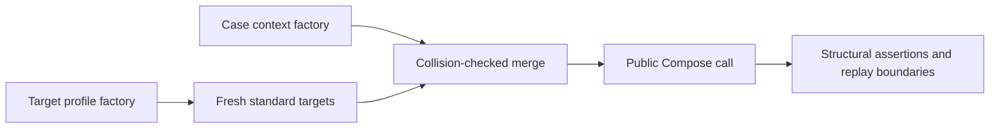

# Generated Transform Target Contracts

**Status:** Implemented
**Scope:** public `DualTransform` execution across images, annotations, volumes, and batches
**Primary readers:** maintainers adding transform modes, targets, metadata requirements, or target-specific behavior

## What adding a registry case now covers

Every registered `DualTransform` mode automatically runs against each applicable core target profile. A new constructor
mode therefore receives image/mask, horizontal bounding box (HBB), oriented bounding box (OBB), keypoint, and
volume/`mask3d` coverage without another transform list.
One primary mode per class also runs against the more expensive dtype, channel, batch, empty-target, memory-layout, and
read-only profiles.

The generated matrix answers two different questions:

| Matrix | Cases | Profiles | Property under test |
|---|---|---|---|
| Core | Every registered mode | Applicable core profiles | A public mode executes every declared target and preserves target structure |
| Extended | One explicit primary mode per class | Applicable extended profiles | Mode-independent dtype, channel, batch, empty-target, and memory contracts hold |

Running every mode through the core profiles closes the gap that allowed a new mutually exclusive constructor mode to
miss bbox, keypoint, or volume tests. Restricting extended profiles to primary modes controls runtime because these
workloads test array representation rather than constructor branching.

## One configuration inventory, reusable target workloads

`tests/helpers/transform_cases.py` is the only shared transform/kwargs inventory. A `TransformContractCase` owns:

- a stable `case_id` and public constructor kwargs;
- the primary data and `Compose` settings used by constructor serialization and applied-configuration replay;
- a context factory for transform-required metadata such as reference images or donor records;
- target prerequisites such as a non-empty mask or bbox set;
- replay strength and deterministic seeds.

`tests/helpers/target_profiles.py` owns input workloads and output assertions. Profiles contain no transform classes and
no transform kwargs. This separation lets one new profile cover the complete applicable registry and lets one new mode
inherit the complete core target matrix.

Input assembly and execution follow one visible path:



A collision is a registry error. Context never silently replaces a profile target.

## Core profiles exercise synchronized targets

Core fixtures use non-square `96×128` spatial dimensions. Images encode row and column coordinates, masks contain
several asymmetric class regions, and annotations carry multiple aligned label fields.

| Profile ID | Public targets | Main assertions |
|---|---|---|
| `image-mask` | `image`, `mask` | Spatial shape, dtype, and mask synchronization |
| `hbb-labels` | image, mask, HBBs, two label fields | Finite normalized boxes and row-aligned fields |
| `obb-labels` | image, mask, OBBs, two label fields | Finite normalized geometry, angle column, and aligned fields |
| `keypoints-labels` | image, mask, keypoints, labels | Finite keypoints and aligned labels |
| `volume-mask3d` | `volume`, `mask3d` | Slice/depth behavior, spatial synchronization, and dtype |

The HBB and OBB profiles use separate `BboxParams`. A case collects only for bbox types declared in
`_supported_bbox_types`.

## Extended profiles cover representation hazards

Extended profiles run one primary mode per class:

- float32, one-channel, and five-channel image/mask data;
- `images`, `masks`, `volumes`, and `masks3d` batches;
- empty HBB and keypoint collections;
- non-contiguous image/mask views; and
- read-only image/mask arrays.

The channel profiles use the optional `_supported_channel_counts` capability. Transforms with a real channel-count
restriction declare it on the transform class, so the resolver remains free of transform-name branches.

## Applicability comes from public behavior

`tests/helpers/target_contracts.py` creates a pair only when all of these conditions hold:

1. the case class is a `DualTransform`;
2. the profile contains every target required by the case;
3. a required target is non-empty when the mode needs data from it;
4. the transform's declared `_targets` contain every profile target, including batch forms derived from their singular
   target;
5. the requested bbox type is declared; and
6. the profile channel count is supported when the transform declares a restriction.

The resolver selects pairs from capabilities. A missing declared capability prevents collection. A collected pair that
cannot execute fails with its case ID and profile ID.

Meta-tests enforce that pair IDs are unique, every registered `DualTransform` case has core coverage, and every profile
collects at least once. Performance pressure is handled by the core/extended tier boundary; applicable core pairs are
never sampled or skipped.

## Every pair crosses the same public boundaries

The runner constructs `Compose` with `p=1`, `strict=True`, `save_applied_params=True`, and seed `137` unless the case
declares another seed. It then performs this sequence:

1. build fresh profile targets and case context;
2. execute the public `Compose` call;
3. verify that caller-owned inputs remain unchanged;
4. run the profile's structural and synchronization assertions;
5. transport `applied_transforms` through strict JSON;
6. reconstruct with `Compose.from_applied_transforms()` and execute on fresh equivalent input;
7. compare every input target, label field, and context value exactly for `ReplayProfile.EXACT` cases; and
8. run a separate `ReplayCompose` capture/replay and compare the complete input payload exactly.

Applied-configuration replay and `ReplayCompose` preserve different state. The first records a runnable realized
constructor policy. The second records parameters from one invocation. Both boundaries stay in the runner so target
support cannot pass by exercising only one persistence API.

`tests/helpers/contract_assertions.py` supplies the shared recursive equality and mutation diagnostics used by target,
applied-configuration, and constructor-serialization tests.

## Specialized tests keep precise semantics

Generated profiles own broad execution, synchronization, replay, dtype, layout, and batch responsibilities. A focused
test remains when it has a stronger oracle, such as:

- exact crop coordinates or OBB refitting geometry;
- exact interpolation label values;
- deterministic sampling and distribution properties;
- zero-size prevention; or
- empty-depth and empty-batch representation regressions.

Do not retain a focused test whose only assertions are “the transform did not raise,” “the target key exists,” or “the
annotation has the expected column count.” The generated cluster already checks those properties across every
applicable mode.

## Contributor workflow

When adding or changing a transform mode:

1. add one named case to `tests/helpers/transform_cases.py`;
2. declare every target, bbox type, and genuine channel-count restriction on the transform;
3. set `required_targets` when parameter sampling needs a non-empty mask or bbox collection;
4. add a context factory when the transform consumes metadata outside the standard targets;
5. run the collection meta-tests and inspect the new `case-id--profile-id` pairs;
6. add a profile only when the array/annotation workload should apply to a cluster of transforms; and
7. add focused tests only for exact transform semantics that shared assertions cannot express.

Use these commands for fast feedback:

```bash
uv run pytest -q tests/contracts/test_target_cluster_contract.py -W error::RuntimeWarning
uv run pytest -n auto -q tests/contracts/test_target_cluster_contract.py
uv run pytest -q tests/contracts tests/test_serialization.py
uv run python -m tools.quality_gate fast
```

## Completion invariants

The architecture remains complete while:

- adding one registered mode automatically creates all applicable core pairs;
- target profiles contain no transform class lists or constructor kwargs;
- core selection uses declared capabilities and has no class-name skip branches;
- all-mode and primary-mode views are explicit at each consumer;
- every invocation uses fresh deterministic data and checks caller-input mutation;
- strict JSON applied replay and exact `ReplayCompose` replay both execute;
- specialized tests state a stronger semantic property than the generated cluster; and
- the contract suite passes under `pytest-xdist` without shared mutable state.

## References

- `tests/helpers/transform_cases.py`: canonical public constructor modes
- `tests/helpers/contract_data.py`: fresh target and context factories
- `tests/helpers/target_profiles.py`: reusable workloads and assertions
- `tests/helpers/target_contracts.py`: capability resolver, pair generation, and runner
- `tests/contracts/test_target_cluster_contract.py`: generated matrix and completeness checks
- `docs/design/applied-config-replay-contracts.md`: persistence boundaries and replay strength
