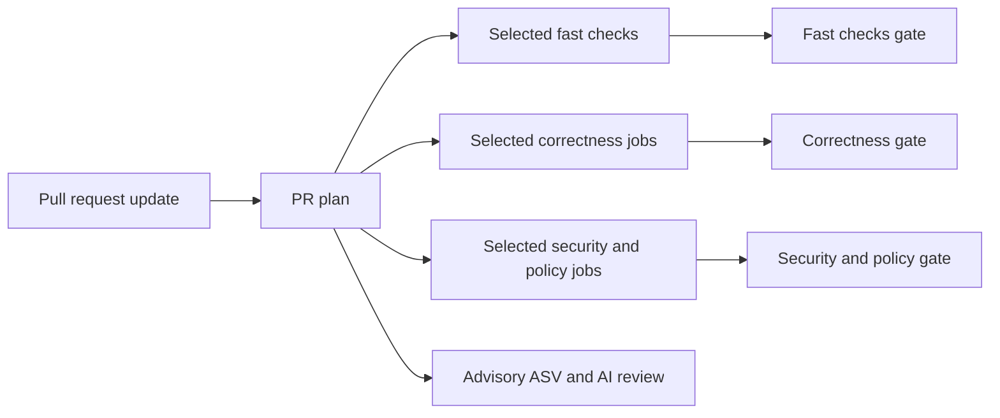

# Greenfield CI plan: fast wall time with risk-based routing

## Decision

If the GitHub Actions setup were designed from scratch, it should not run every
available check for every pull request. It should first classify the changed
files, then run the smallest check set that can detect regressions relevant to
those files.

The primary optimization target is **merge-ready wall time**, measured from the
latest pull-request update until every required check has reported a final
result. Runner-minutes are a secondary constraint. Two-minute jobs are
acceptable when they run in parallel; irrelevant jobs and missing required
statuses are not.

The recommended first version is deliberately conservative:

1. Do not run Python tests for documentation-only, workflow-only,
   benchmark-only, or legal-only changes.
2. Keep the full supported OS/Python matrix for runtime Python changes until a
   narrower impact selector has proved reliable in shadow mode.
3. Make every required check name stable and always reported.
4. Remove ASV and language-specific CodeQL job names from the global required
   status-check list.
5. Reduce the duration of relevant test jobs before reducing their coverage.
6. Split only lanes whose p95 duration remains above two minutes.

This gets most of the wall-time benefit without initially betting correctness
on a source-to-test dependency graph.

## Implementation status

The repository implementation now follows this design:

- `.github/workflows/pr.yml` always starts and reports the stable plan and
  aggregate gates;
- `tools/ci_plan.py` performs fail-closed path routing;
- purpose-specific dependency groups replace the broad CI `dev` install;
- coverage and PyTorch are removed from ordinary compatibility cells;
- Windows 3.11–3.13 use two measured duration-balanced shards;
- nightly and release-candidate workflows retain the complete 3 × 5 suite;
- security, legal, packaging, ASV, and Antigravity work is routed by relevance.

The main-branch repository ruleset now requires `PR plan`, `Fast checks`,
`Correctness`, `Security and policy`, and `license/cla`. Exact `Analyze (*)`,
matrix-leaf, `ASV benchmark evidence`, and `CodeQL` contexts have been removed.
Default setup does not analyze pull requests from forks, so a globally required
`CodeQL` context would block external contributions without creating an
analysis. Hosted-runner p50/p95 still need to be measured over multiple
post-cutover runs, so the service levels below remain targets rather than
measured guarantees.

## What the current checks are doing

The current required PR configuration mixes four different concerns:

- product correctness across 3 operating systems and 5 Python versions;
- repository quality checks such as formatting, typing, and custom contracts;
- policy checks for security, licensing, packaging, and CLA status;
- advisory evidence such as performance benchmarks and AI review.

Those concerns do not have the same relevance rules and should not share one
global required-check policy.

### Measured baseline

The following measurements were collected on 2026-07-14 from representative
successful runs. They are observations, not projected timings.

| Workflow or job | Observed wall time | Observation |
| --- | ---: | --- |
| CI workflow | 3m 41s | 15 test lanes plus one repository-hooks lane |
| All CI jobs combined | about 40.9 runner-minutes | Sum of job elapsed time; not GitHub's rounded billing total |
| Slowest CI lane | 3m 23s | Windows, Python 3.12 |
| Repository hooks | 1m 35s | About 1m 02s was the serial `pre-commit --all-files` step |
| Dependency audit | 10s | Already short; selection matters more than optimization |
| Workflow hardening audit | 12s | Already short; selection matters more than optimization |
| Legal integrity | 11s | Already short; selection matters more than optimization |
| ASV benchmark evidence | 51s | Mostly dependency setup and ASV importability checking |
| Antigravity review | 3m 28s | About 3m 16s was model execution |

The CI baseline comes from
[Actions run 29332387845](https://github.com/albumentations-team/AlbumentationsX/actions/runs/29332387845).
The full Ubuntu/Python 3.12 JUnit artifact contained 12,047 test cases. Its
largest cumulative groups were serialization, transforms, core, augmentations,
and 3D transforms. These groups are useful inputs for sharding, but JUnit times
from an xdist run are workload weights rather than a prediction of serial wall
time.

A local comparison on the same test selection measured 17.68 seconds without
coverage and 24.76 seconds with branch coverage and XML output. That is about
40% overhead in the local environment. It is directional evidence only; the
effect must be measured again on GitHub-hosted runners before setting a target.

### Why the two pending checks are not real running jobs

`Analyze (actions)` and `ASV benchmark evidence` are shown as
`Expected — Waiting for status to be reported` because the ruleset requires
those exact status names but no job reported them for the commit. They are not
queued behind a runner.

GitHub distinguishes between two cases:

- A workflow skipped by a top-level branch or path filter does not report its
  required status, so the pull request remains pending.
- A job inside an already-started workflow skipped by `jobs.<job_id>.if`
  reports `Skipped`, which satisfies a required status.

This behavior is documented in GitHub's
[required-check troubleshooting guide](https://docs.github.com/en/pull-requests/collaborating-with-pull-requests/collaborating-on-repositories-with-code-quality-features/troubleshooting-required-status-checks?apiVersion=2022-11-28)
and
[job-condition documentation](https://docs.github.com/en/enterprise-cloud@latest/actions/how-tos/write-workflows/choose-when-workflows-run/control-jobs-with-conditions).

The current ASV workflow has top-level `paths` filters, while the ruleset
requires `ASV benchmark evidence` for every pull request. That combination
guarantees a pending required check whenever none of those paths changes.

`Analyze (actions)` is a language-specific CodeQL/default-setup job name for
GitHub Actions workflow analysis. Language-specific CodeQL jobs are dynamic:
GitHub can add, omit, or rename them as detected languages and product setup
change. The pull request already has the stable `Code scanning results / CodeQL`
gate and a successful Python analysis. A stale dynamic job name should not also
be required globally.

The aggregate `CodeQL` context is also unsuitable as a global requirement while
the repository uses default setup. GitHub excludes pull requests from forks
from default-setup analysis, so those pull requests never report the context.

### ASV, not AST

ASV means **airspeed velocity**. It is the Python benchmarking framework used
under `benchmark/`; it is unrelated to Python's abstract syntax tree.
The [ASV documentation](https://asv.readthedocs.io/en/stable/using.html)
distinguishes between `asv check`, which validates benchmark-suite discovery,
and actual benchmark runs/comparisons.

The repository's `ASV benchmark evidence` job currently does more than time
code. It validates benchmark catalog coverage, compares catalog evidence with
the base revision, checks that ASV can import the benchmark suite, and uploads
review artifacts. It is useful when runtime or benchmark code changes, but it
has no signal for a Markdown-only, legal-only, or unrelated workflow change.

It is also currently declared `continue-on-error: true`. Therefore making its
leaf job globally required is internally inconsistent: it can leave unrelated
PRs pending when absent, but does not block a performance problem when present.

## Target behavior

### Wall-time service levels

Measure wall time from the latest `pull_request.synchronize`, `opened`,
`reopened`, or `ready_for_review` event until all required gates finish. Include
runner queue time. Report advisory completion separately.

| Pull-request class | Required-check p50 target | Required-check p95 target |
| --- | ---: | ---: |
| Markdown/documentation only | 20s | 45s |
| Workflow, legal, or benchmark infrastructure only | 30s | 60s |
| Normal runtime Python change | 90s | 120s |
| Dependency, packaging, PyTorch, or platform-sensitive change | 120s | 180s |
| Explicit full verification | No initial target | Report separately |

These are rollout targets, not claims about the current runners. If standard
GitHub-hosted runner queue time alone violates a target, record queue and
execution separately before changing test topology.

### Stable required gates

The branch ruleset should require only check names that every PR workflow run
always creates:

1. `PR plan`
2. `Fast checks`
3. `Correctness`
4. `Security and policy`
5. The existing external `license/cla` gate

Do not require individual matrix cells, ASV leaf jobs, CodeQL language jobs,
the aggregate `CodeQL` context from default setup, OpenSSF Scorecard,
Antigravity, Sourcery, or coverage-upload jobs.

The four repository-owned gates should be aggregation jobs with fixed names.
They run with `if: always()`, inspect the router plan plus every relevant leaf
result, and fail closed:

- a selected job must finish successfully;
- a non-selected job may be skipped;
- a selected job that is skipped, cancelled, or missing fails the gate;
- an unknown path or router error selects the conservative full profile.

This separates the branch-protection API from the internal job graph. Matrix
dimensions and job names can then change without editing the ruleset.

## Change router

### Shape

Create one required PR workflow with no top-level `paths` or `paths-ignore`.
Its first job, `PR plan`, obtains the complete base-to-head file list and emits
a machine-readable plan.

Use a repository-owned Python entry point such as `tools/ci_plan.py`, covered
by unit tests. Avoid encoding the routing policy only in YAML expressions.
The router should:

1. fetch the PR base and head commits;
2. read a NUL-delimited `git diff --name-only` result;
3. classify every path into one or more risk domains;
4. output booleans and matrices through `GITHUB_OUTPUT`;
5. write the same decision and its reasons to `GITHUB_STEP_SUMMARY`;
6. select `full` if a path is unknown, the diff cannot be read, or the router
   itself fails.

Do not use top-level GitHub path filters as the source of truth. Besides the
required-status problem, GitHub documents a
[300-file limit for workflow path-filter evaluation](https://docs.github.com/en/actions/how-tos/troubleshoot-workflows).

### Domains

The domains are additive rather than mutually exclusive. A PR changing both
runtime code and documentation gets both sets of checks.

| Domain | Representative paths | Main risk |
| --- | --- | --- |
| `docs` | `**/*.md`, documentation assets | Broken prose, links, examples, or package-description rendering |
| `runtime` | `albumentations/**/*.py` except dedicated PyTorch paths | Product behavior, API, serialization, typing |
| `tests` | `tests/**` | Test validity; shared fixtures can affect the whole suite |
| `pytorch` | `albumentations/pytorch/**` and related tests | Dedicated heavyweight Tensor and TorchVision behavior |
| `dependencies` | `pyproject.toml`, `uv.lock`, requirements/conda metadata | Resolution, installability, vulnerabilities, cross-platform wheels |
| `packaging` | build backend configuration, package manifests, release build code | Wheel/sdist contents and metadata |
| `workflows` | `.github/workflows/**`, local actions | Actions syntax, permissions, supply-chain hardening |
| `legal` | license, CLA, provenance files and verifier | Required notices and CLA archive integrity |
| `benchmarks` | `benchmark/**`, benchmark coverage/budget tools | Benchmark discovery and performance evidence |
| `ci_tooling` | CI selectors, matrix validators, pre-commit configuration | False skips or broken gates |
| `unknown` | Any path not explicitly classified | Unmodeled risk; run the conservative profile |

### Routing table

The following table is the conservative first implementation. “Full matrix”
means the current 3 OS × 5 Python versions unless the support policy changes.

| Change shape | Run | Do not run |
| --- | --- | --- |
| Only Markdown under `docs/**` or ordinary Markdown files | Markdown syntax/style, codespell on changed files, link/example checks when configured | pytest, Python typing, dependency audit, workflow audit, legal build, ASV, CodeQL language jobs |
| `README.md` only | Markdown checks plus lightweight package-description rendering or `twine check` if desired | pytest and the compatibility matrix |
| Runtime Python | Ruff/format, full typing and contracts, full compatibility matrix, primary coverage, relevant performance evidence | Unrelated legal build and workflow audit |
| Isolated test files only | Changed test modules on the primary lane and supported-version smoke lanes | Full product matrix, unless the test touches shared infrastructure |
| `tests/conftest.py`, `tests/helpers/**`, pytest configuration | Full matrix | Unrelated legal/workflow jobs |
| Dependency or lockfile | Lock consistency, dependency audit, install smoke on all OSes and min/max Python, full primary suite | ASV unless runtime performance dependencies changed |
| PyTorch runtime/tests | Dedicated PyTorch tests and import smoke, relevant compatibility lanes | Installing Torch in every unrelated test lane |
| Workflow/local-action only | YAML/action checks, zizmor, CodeQL Actions analysis, CI contract tests | Product pytest matrix unless the PR changes the test workflow itself |
| Main PR test workflow or CI router | Workflow audit, router tests, at least one full sentinel test lane, compatibility smoke | None of the CI self-tests selected by the router |
| Legal/provenance only | Legal verifier tests, artifact notice verification when packaging can change | Product pytest matrix, dependency audit, ASV |
| Packaging/build configuration | Wheel/sdist build, `twine check`, clean-environment import smoke, legal artifact verification, min/max Python install | Full 15-cell test matrix unless runtime dependencies also change |
| Benchmark code/tools only | Benchmark catalog checks and `asv check`; targeted benchmark tool tests | Product pytest matrix and ASV timing comparison by default |
| Performance-sensitive runtime path | Normal runtime checks plus ASV evidence; comparison when labeled or selected by policy | Global performance blocking until thresholds are stable |
| Unknown, broad, or mixed high-risk change | Full conservative profile | Nothing selected by the router |

Documentation changes inside a runtime docstring count as `runtime`, because the
changed file is executable Python. Markdown embedded in packaging metadata can
also select `packaging`; the router must classify by path and consequence, not
file extension alone.

## What should happen to each current check

### CI test matrix

Keep it for runtime changes in the first rollout. The lanes already run in
parallel, and their one-to-three-minute durations are not individually
alarming. Eliminate them entirely for file classes where they cannot produce
signal.

For relevant runtime PRs, first make each lane faster:

- collect branch coverage only on one primary Linux/Python lane;
- do not generate 15 identical coverage XML files when only one is uploaded;
- move PyTorch tests to a dedicated profile and stop installing Torch and
  Torchvision in every lane;
- install only the locked test dependency group, not the complete developer
  toolchain;
- upload full evidence from the primary lane and compact failure evidence from
  compatibility lanes;
- pin the number of xdist workers to the actual runner shape instead of relying
  on an environment-dependent `-n auto`;
- benchmark `--dist=worksteal` for uneven tests. pytest-xdist documents that it
  can handle differing durations better while preserving useful fixture reuse.

The official
[pytest-xdist distribution guide](https://pytest-xdist.readthedocs.io/en/stable/distribution.html)
should be the reference when choosing the worker count and scheduler.

### Repository hooks

Do not keep one serial `pre-commit --all-files` job as the only PR quality
gate. Preserve that command for local use and scheduled repository sweeps, but
split PR work into parallel leaves:

- formatting and Ruff on changed Python files;
- mypy on the full typed source graph when runtime APIs change;
- pyrefly on the same source graph;
- repository contracts selected by domain;
- Markdown/codespell checks only when text changes.

If `.pre-commit-config.yaml`, `pyproject.toml`, or a quality-check script
changes, run the affected check across all files. The stable `Fast checks`
aggregator hides these internal leaves from branch protection.

### Dependency and workflow security

The 10-second dependency audit and 12-second workflow audit are already fast.
Do not split them. Route them:

- run dependency audit for runtime dependency, lockfile, or packaging changes;
- run zizmor for `.github/**` or local-action changes;
- run both on a schedule and before a release;
- skip both for ordinary Markdown and unrelated runtime source changes.

OpenSSF Scorecard is already skipped on PRs by design. Keep it scheduled and
never make its PR job name required.

### CodeQL

Do not require `Analyze (actions)` or `Analyze (python)` as exact status-check
names. They are advisory language-specific checks that are skipped when their
path filter finds no relevant input.

Preferred policy:

- keep CodeQL enabled for pull requests with relevant inputs and weekly scans;
- keep both language checks advisory because path filtering intentionally
  omits them from unrelated pull requests;
- run Python analysis for runtime or Python tooling changes;
- run Actions analysis for workflow/local-action changes;
- run the complete scan on the default branch and weekly;
- do not run a language analysis for Markdown-only changes.

This repository uses advanced setup. `codeql-python.yml` selects Python source,
stubs, and CodeQL configuration. `codeql-actions.yml` selects workflow and
composite-action files. GitHub Default Setup must remain disabled because it
suppresses advanced workflows and blocks their SARIF uploads. Validate a
fork-based pull request before making either CodeQL check a merge gate.

### Legal integrity

Route source-tree legal checks to legal, packaging, and release-related paths.
Build and inspect wheel/sdist notices when those artifacts can change. There is
no need to build distributions for an ordinary documentation or transform
implementation change if packaging inputs and legal artifacts are untouched.

The pre-redesign `ci-policy.md` said Legal Integrity ran on every PR. The
implementation therefore updates policy and YAML together.

### Performance and ASV

Remove `ASV benchmark evidence` from the global required-status list now.

Run the lightweight evidence job when one of these changes:

- `albumentations/**` runtime code covered by the benchmark catalog;
- `benchmark/**`;
- benchmark coverage, filter-selection, or performance-budget tools;
- the performance workflow itself.

Skip it for Markdown-only, legal-only, test-only, dependency-only, and
unrelated workflow changes. Keep actual ASV before/after comparisons for the
`run-performance` label, scheduled runs, manual investigation, and explicitly
performance-sensitive paths.

While the performance jobs are `continue-on-error`, treat them as advisory and
do not add them to branch protection. If performance later becomes blocking,
remove `continue-on-error`, define stable thresholds, and introduce an
always-reported `Performance` aggregator instead of requiring conditional leaf
jobs.

### Antigravity and Sourcery

Keep AI reviews advisory. Their completion should not contribute to
merge-ready wall time. Antigravity can continue for non-draft source,
test, workflow, security, or legal changes, with concurrency cancellation so
only the latest commit is reviewed. Skip trivial dependency-bot and pure
formatting changes, or make them opt-in with a label.

Splitting a three-minute model review is not a priority because it does not
block merging. If review feedback latency later matters, split by review domain
only after measuring whether smaller prompts reduce model time enough to offset
additional jobs and cost.

## Making relevant jobs finish within two minutes

### Dependency profiles

Split the current broad `dev` dependency group into CI-purpose profiles, for
example:

- `ci-test` for the core test suite;
- `ci-quality` for Ruff, formatting, and repository contracts;
- `ci-types` for mypy and pyrefly;
- `ci-pytorch` for Torch-specific tests;
- `ci-security` for dependency and workflow audits;
- `ci-benchmark` for ASV evidence;
- `ci-package` for build, twine, and legal artifact checks;
- `ci-release` for release evidence and SBOM tooling.

Each job should sync only its profile. Keep one lockfile and verify it once when
dependency metadata changes. This reduces downloads, environment creation, and
cache churn without changing test selection.

Continue using `setup-uv` caching with keys that include OS, Python, `uv.lock`,
and dependency profile. Follow uv's
[GitHub Actions cache guidance](https://docs.astral.sh/uv/guides/integration/github/).
Do not cache `.venv` by default; benchmark it first because large, frequently
invalidated environment caches can cost more wall time than they save.

### Coverage

Coverage should be collected once per logical primary suite, not once per
compatibility cell. Compatibility lanes answer “does this behavior work here?”;
the primary lane answers “which source lines and branches were exercised?”

Start with Ubuntu and Python 3.12 as the primary coverage lane. Run all other
cells without `pytest-cov`. If the primary lane remains over two minutes, shard
that lane and combine its `.coverage.*` artifacts in a small reporting job.
Keep coverage reporting advisory during the first timing experiment so the
combination tail does not hide test wall-time improvements.

### Cancellation and drafts

Add workflow-level concurrency to every PR workflow:

```yaml
concurrency:
  group: ${{ github.workflow }}-${{ github.event.pull_request.number || github.ref }}
  cancel-in-progress: true
```

GitHub documents that `cancel-in-progress` stops obsolete runs in the same
concurrency group. This improves real contributor latency when several commits
are pushed quickly and avoids old runs occupying scarce Windows/macOS slots.
See the
[workflow concurrency documentation](https://docs.github.com/en/actions/how-tos/write-workflows/choose-when-workflows-run/control-workflow-concurrency).

For draft PRs, run the router and fast checks. Start the expensive relevant
profile at `ready_for_review`, while still allowing a `full-ci` label or manual
dispatch. This saves compute during iteration; it does not change the final
merge-ready target.

### Runner size

Do not buy larger runners before routing, dependency profiles, coverage
deduplication, and selective sharding are measured. Larger runners are a valid
last-mile wall-time option for a persistent CPU-bound critical path, but GitHub
states that they are always billed, including for public repositories. See
[GitHub's larger-runner pricing](https://docs.github.com/en/billing/reference/actions-runner-pricing).

## Splitting only the jobs that remain slow

### Trigger for sharding

Collect at least 20 successful runs after the low-risk optimizations. Split a
lane only when its execution-time p95, excluding queue time, remains above 120
seconds. On the current baseline this is most likely to affect some Windows
lanes first.

### Test sharding design

Create a deterministic repository-owned sharder rather than hand-maintained
lists in workflow YAML:

1. Store historical weights by test file or stable node ID in
   `ci/test-durations.json`.
2. Generate that file from successful nightly JUnit artifacts.
3. Greedily assign test groups to two shards with approximately equal weight.
4. Assign new or missing tests deterministically and never omit them.
5. Add a contract test proving that every collected test is assigned exactly
   once.
6. Use the same environment and xdist worker count in both shards.
7. Aggregate shard results behind the stable `Correctness` gate.

Start with two shards for a slow lane. Increase to four only if a two-shard
lane still misses the wall-time SLO. GitHub matrices run in parallel unless
`max-parallel` limits them; do not cap parallelism on the required critical
path. GitHub's
[matrix documentation](https://docs.github.com/en/enterprise-cloud@latest/actions/how-tos/write-workflows/choose-what-workflows-do/run-job-variations)
describes `fail-fast` and `max-parallel` behavior.

### Quality-check sharding

The existing hook job is a better first split than the whole pytest matrix.
Ruff/format, mypy, pyrefly, and repository contracts are independent and can
start together. They should share a small reusable setup definition but run as
separate jobs so the longest tool, not the sum of all tools, determines wall
time. GitHub supports
[reusable workflows](https://docs.github.com/en/actions/reference/workflows-and-actions/reusing-workflow-configurations)
for sharing complete job definitions and composite actions for sharing step
sequences.

### Jobs not worth splitting

Do not split the current dependency audit, workflow audit, legal check, or
lightweight ASV evidence job. At 10–51 seconds, runner startup and duplicated
setup would dominate. Route them correctly instead.

## Proposed workflow layout

```text
.github/workflows/
  pr.yml                     # Always starts; router, leaves, stable gates
  nightly.yml                # Full 3x5 suite, minimum deps, broad properties
  release-candidate.yml      # Release evidence and artifact verification
  performance.yml            # Advisory ASV evidence/comparisons
  antigravity-pr-checks.yml  # Advisory AI review
.github/actions/
  setup-ci/action.yml        # Composite uv/cache/profile setup
tools/
  ci_plan.py                 # File-domain classifier and execution plan
  ci_gate.py                 # Fail-closed aggregation validation
  ci_shard.py                # Duration-balanced test selection
ci/
  test-durations.json        # Weights refreshed from successful JUnit evidence
```

The logical flow is:



The advisory branch is intentionally absent from the required critical path.

## Original rollout plan

The implementation used a direct cutover rather than leaving shadow or
migration workflows in the repository. The phases remain here as the audit
trail for the order and safety conditions behind the design.

### Phase 0: fix required-check deadlocks

1. Remove `ASV benchmark evidence` from the ruleset's global required status
   checks.
2. Remove stale/dynamic `Analyze (actions)` and language-specific `Analyze (*)`
   contexts from required status checks.
3. Remove the aggregate `CodeQL` context while default setup excludes pull
   requests from forks.
4. Verify with one fork-based PR, one Markdown-only PR, one source PR, and one
   workflow-only PR that every required context reports a final result.

This phase fixes the current pending state without redesigning test coverage.

### Phase 1: instrument and establish p95

1. Add concurrency cancellation to PR workflows.
2. Record queue time, setup time, test time, artifact time, and total job time.
3. Add pytest duration output and retain compact JUnit artifacts.
4. Collect at least 20 representative successful PR updates.
5. Report p50/p95 by OS, Python, dependency profile, and change domain.

### Phase 2: add the router and stable gates in shadow mode

1. Implement and unit-test `tools/ci_plan.py`.
2. Compute the proposed plan while current checks still run.
3. Compare planned skips with what actually failed in the full run.
4. Treat every false skip or unknown path as a router defect.
5. Add stable aggregate jobs, but do not change branch protection yet.

### Phase 3: stop definitely irrelevant work

1. Switch Markdown-only PRs to Markdown checks only.
2. Route workflow audit, dependency audit, legal integrity, packaging, and ASV
   using the table above.
3. Keep runtime source PRs on the full test matrix.
4. Update `ci-policy.md`, `support-policy.md`, `release-process.md`, and the CI
   matrix validator together so documented policy matches execution.
5. Replace leaf matrix requirements in the ruleset with stable gates.

### Phase 4: shorten relevant jobs

1. Introduce dependency profiles.
2. Move PyTorch into its dedicated job.
3. Remove coverage from compatibility lanes.
4. Split the serial hook job into parallel quality jobs.
5. Re-measure p95 before adding any test shards.

### Phase 5: shard only p95 outliers

1. Add two duration-balanced shards to each lane still above 120 seconds.
2. Validate exact-once test assignment.
3. Keep full unsharded scheduled runs temporarily to compare results.
4. Increase shard count only if the wall-time SLO remains unmet.

### Phase 6: optional impact-based compatibility testing

After at least a month of shadow data, consider replacing the full 15-cell
suite on low-risk runtime changes with:

- a complete primary Linux suite;
- min/max Python smoke lanes;
- Windows and macOS smoke lanes;
- targeted impacted tests across the full compatibility matrix;
- the complete 3 × 5 suite nightly and for `full-ci`.

Do not enter this phase until the selector demonstrates that it would have
selected every failing test observed in the shadow period. Unknown runtime
paths must continue to select the full matrix.

## Acceptance criteria

The redesign is ready when all of the following hold:

- no PR shows `Expected — Waiting for status to be reported` for a conditional
  repository-owned job;
- Markdown-only p95 required wall time is at most 45 seconds;
- ordinary runtime-change p95 required wall time is at most 120 seconds;
- no individual relevant job exceeds 120 seconds p95 unless it is explicitly
  classified as a high-risk/full-verification lane;
- every required gate reports for every PR event;
- every selected pytest node runs exactly once across shards;
- nightly continues to cover every supported OS/Python combination;
- skipped profiles and router reasons are visible in the workflow summary;
- stale-commit runs are cancelled;
- false-skip rate in the shadow comparison is zero before impact-based runtime
  selection becomes authoritative;
- runner-minute changes are reported, even though wall time is the primary
  decision metric.

## Implemented outcome

The first implementation is deliberately narrow:

1. fix the two stale/missing required contexts;
2. add an always-running router and stable aggregate gates;
3. stop pytest for Markdown-only and other obviously unrelated changes;
4. keep the full matrix for runtime source changes;
5. remove duplicate coverage and universal PyTorch installation;
6. split hooks in parallel;
7. shard only the lanes that still exceed two minutes.

That sequence improves contributor wall time quickly while preserving the
current compatibility guarantee until evidence supports a more selective
runtime test policy.
